# Extensions

Extensions for the OpenSCAD Polyhedra library.

## Sheets

Creates a polyhedron model out of sheets that cover the faces.

## Tube Connectors


Models of polyhedra can be constructed in a variety of ways, one of them by connecting tubes that serve as the edges of the polyhedra. In this extension small connector pins are modelled for all the polyhedra in the library. These can then be 3d printed, and combined with some tubes form a nice wire frame model of the polyhedra.

## Iconhedra


A Python script that interfaces the OpenSCAD library to generate animated SVGs of polyhedra. To list available polyhedra run

```
iconhedra.py --list
```

To generate the animated svg run with `<polyhedron_name>` from the list or specify a polyhedron with `--file`

```
iconhedra.py <polyhedron_name> [--color '#3498db'] [--animation DURATION]
iconhedra.py --file <polyhedron>.scad
```

See `template.scad` on how to specify the polyhedon vertices and faces data.
